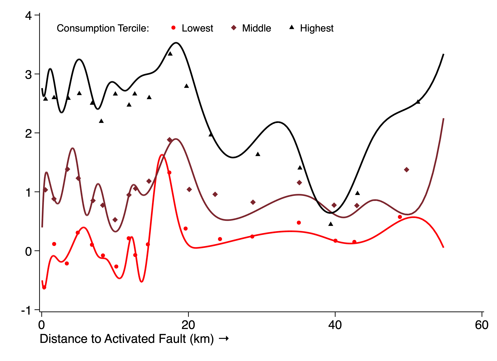
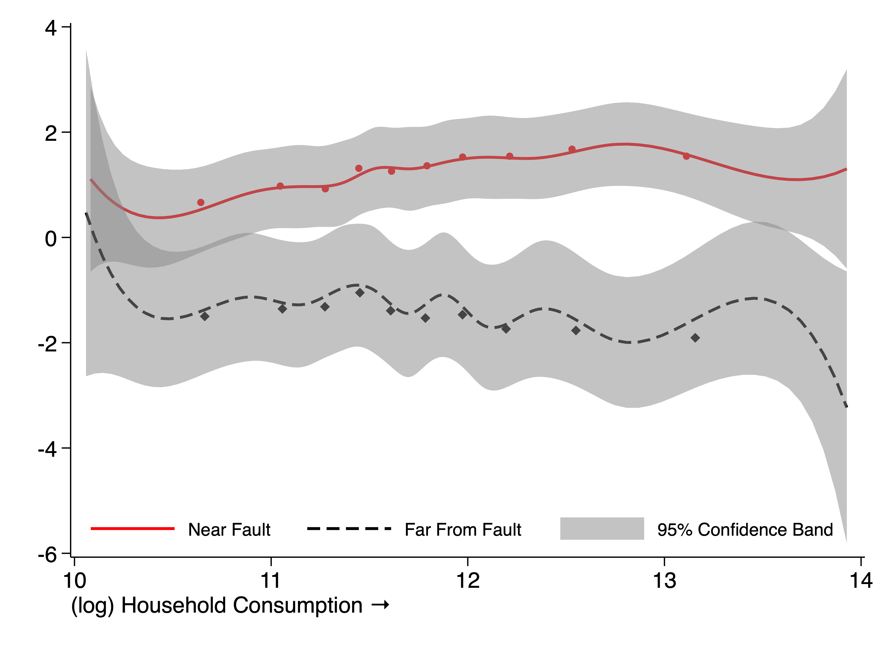

# Table 1: Adult Mental Health Regressions
[Table 1](T_regressions.csv)

This table reports regression estimates of
the effect of the earthquake on the mental health of adults
who responded to the household survey mental health module.
The first column reports the base specification,
including the binary distance to the faultline (within 20km),
the current household consumption measure,
respondent age, gender, marital status and education level,
as well as geographical controls for
distance to epicenter and the slope of the region.
The second includes an interaction term for
consumption and proximity to the activated fault.
The third includes fixed effects at the village level;
the fourth and fifth include fixed effects at the village level
and separately report estimates for women and men.
All regressions are clustered by village (N=126).

# Table 2: Adult Mental Health Regressions with Child Death
[Table 2](T_regressions_death.csv)

This table reports regression estimates of
the effect of the earthquake on the mental health of adults
who responded to the household survey mental health module,
including estimates of the effect of child death
in the household on mental health outcomes.
The first column reports the base specification.
Controls are included for the binary distance to the faultline (within 20km),
the current household consumption measure,
respondent age, gender, marital status and education level,
as well as geographical controls for
distance to epicenter and the slope of the region.
The second and third separately report estimates for women and men.
The fourth column uses household fixed effects.
The fifth includes fixed effects at the village level;
the sixth and seventh include village fixed effects
and report men and women separately.
All regressions are clustered by village (N=126).

# Figure 1: Exogeneity Tests Regression Results

This figure reports the results of a series of exogeneity tests
conducted by regressing various pre-earthquake characteristics
on the distance to the faultline.
Each point represents a normalized regression coefficient
of the listed variable regressed against
the distance to the activated faultline in kilometers.
The results are separated into three families,
where the first family is village characteristics (N=126),
the second is household characteristics (N=2,456),
and the third is individual characteristics
(N varies depending on data source and gender).
Standard errors are clustered at the village level,
and subjected to Benjamini-Hochberg multiple hypothesis testing
with FWER = 0.05 within each family
to determine statistical significance (colored markers).

# Figure 2: Adult Mental Health by Distance

# Figure 3: Adult Mental Health by Consumption

