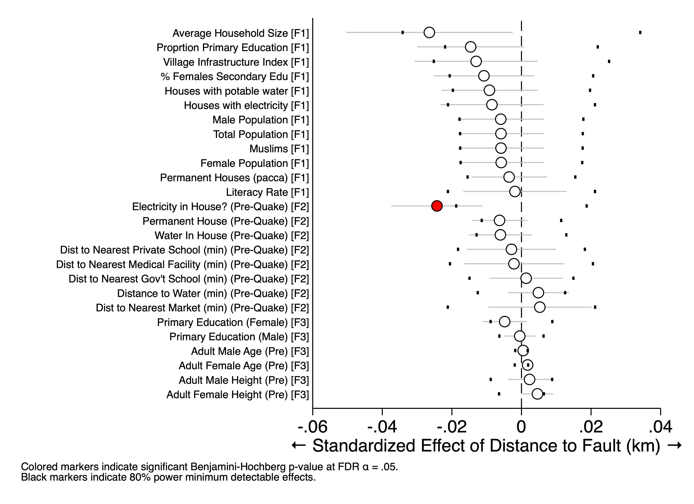

# Table 1: Adult Mental Health Regressions
[Table 1](T_regressions.csv)

This table reports regression estimates of
the effect of the earthquake on the mental health of adults
who responded to the household survey mental health module.
The first column reports the base specification,
including the binary distance to the faultline (within 20km),
the current household consumption measure,
respondent age, gender, marital status and education level,
as well as geographical controls for
distance to epicenter and the slope of the region.
The second includes an interaction term for
consumption and proximity to the activated fault.
The third includes fixed effects at the village level;
the fourth and fifth include fixed effects at the village level
and separately report estimates for women and men.
All regressions are clustered by village (N=126).

# Table 2: Adult Mental Health Regressions with Child Death
[Table 2](T_regressions_death.csv)

# Figure 1: Exogeneity

# Figure 2: Adult Mental Health by Distance

# Figure 3: Adult Mental Health by Consumption

